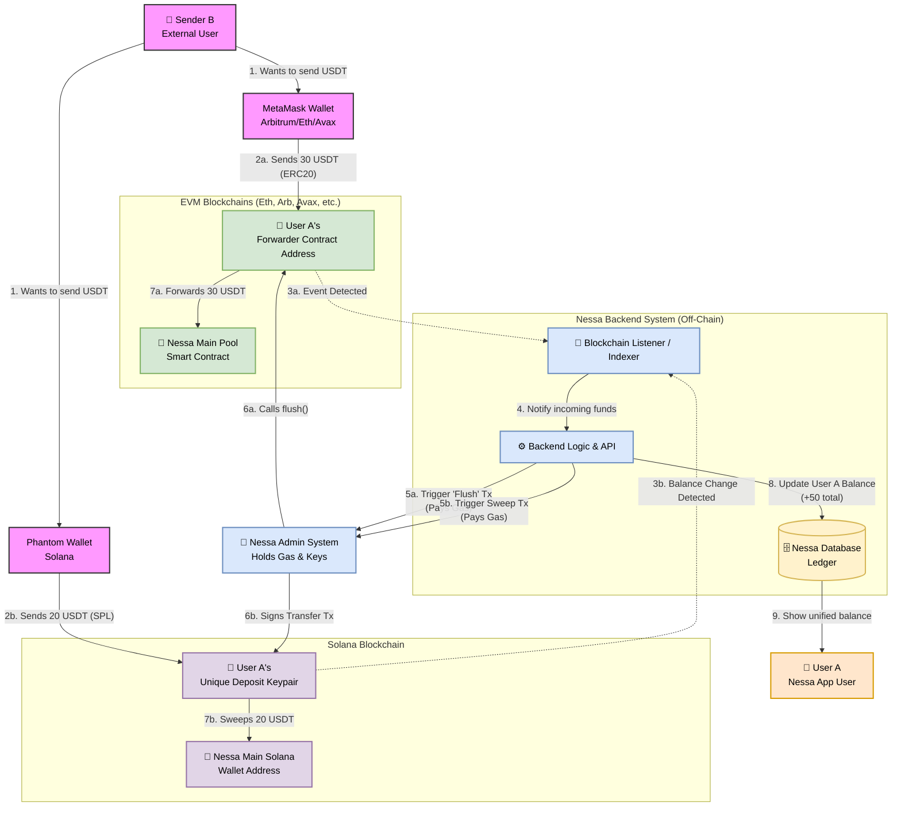

```mermaid
graph TD
    %% --- Define Styles ---
    classDef external fill:#f9f,stroke:#333,stroke-width:2px,color:black;
    classDef evm fill:#d5e8d4,stroke:#82b366,stroke-width:2px,color:black;
    classDef sol fill:#e1d5e7,stroke:#9673a6,stroke-width:2px,color:black;
    classDef nessa fill:#dae8fc,stroke:#6c8ebf,stroke-width:2px,color:black;
    classDef db fill:#fff2cc,stroke:#d6b656,stroke-width:2px,color:black;
    classDef user fill:#ffe6cc,stroke:#d79b00,stroke-width:2px,color:black;

    %% --- Actors ---
    SenderB[👤 Sender B<br/>External User]:::external
    NessaAdmin[🔑 Nessa Admin System<br/>Holds Gas & Keys]:::nessa
    UserA[👤 User A<br/>Nessa App User]:::user

    %% --- External Wallets ---
    MetaMask[MetaMask Wallet<br/>Arbitrum/Eth/Avax]:::external
    Phantom[Phantom Wallet<br/>Solana]:::external

    %% --- Blockchain Layer (EVM) ---
    subgraph "EVM Blockchains (Eth, Arb, Avax, etc.)"
        ForwarderA[📄 User A's<br/>Forwarder Contract Address]:::evm
        MainPoolEVM[🏦 Nessa Main Pool<br/>Smart Contract]:::evm
    end

    %% --- Blockchain Layer (Solana) ---
    subgraph "Solana Blockchain"
        DepositSolA[🔑 User A's<br/>Unique Deposit Keypair]:::sol
        MainPoolSOL[🏦 Nessa Main Solana<br/>Wallet Address]:::sol
    end

    %% --- Nessa Infrastructure ---
    subgraph "Nessa Backend System (Off-Chain)"
        Listener[👀 Blockchain Listener / Indexer]:::nessa
        BackendLogic[⚙️ Backend Logic & API]:::nessa
        DB[(🗄️ Nessa Database<br/>Ledger)]:::db
    end

    %% ================= FLOWS =================

    %% --- 1. The Initial Send ---
    SenderB -- "1. Wants to send USDT" --> MetaMask
    SenderB -- "1. Wants to send USDT" --> Phantom

    MetaMask -- "2a. Sends 30 USDT (ERC20)" --> ForwarderA
    Phantom -- "2b. Sends 20 USDT (SPL)" --> DepositSolA

    %% --- 2. Detection ---
    ForwarderA -. "3a. Event Detected" .-> Listener
    DepositSolA -. "3b. Balance Change Detected" .-> Listener
    Listener -- "4. Notify incoming funds" --> BackendLogic

    %% --- 3. The Sweep (EVM) ---
    BackendLogic -- "5a. Trigger 'Flush' Tx<br/>(Pays Gas)" --> NessaAdmin
    NessaAdmin -- "6a. Calls flush()" --> ForwarderA
    ForwarderA -- "7a. Forwards 30 USDT" --> MainPoolEVM

    %% --- 3. The Sweep (Solana) ---
    BackendLogic -- "5b. Trigger Sweep Tx<br/>(Pays Gas)" --> NessaAdmin
    NessaAdmin -- "6b. Signs Transfer Tx" --> DepositSolA
    DepositSolA -- "7b. Sweeps 20 USDT" --> MainPoolSOL

    %% --- 4. Internal Update ---
    BackendLogic -- "8. Update User A Balance<br/>(+50 total)" --> DB
    DB -- "9. Show unified balance" --> UserA
```