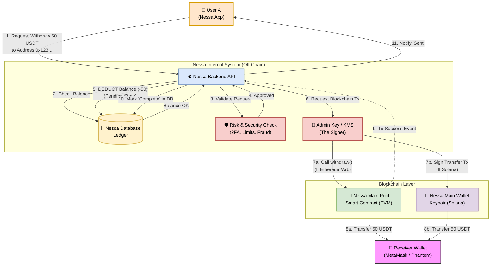

```mermaid
graph TD
    %% --- Define Styles ---
    classDef user fill:#ffe6cc,stroke:#d79b00,stroke-width:2px,color:black;
    classDef nessa fill:#dae8fc,stroke:#6c8ebf,stroke-width:2px,color:black;
    classDef db fill:#fff2cc,stroke:#d6b656,stroke-width:2px,color:black;
    classDef security fill:#f8cecc,stroke:#b85450,stroke-width:2px,color:black;
    classDef evm fill:#d5e8d4,stroke:#82b366,stroke-width:2px,color:black;
    classDef sol fill:#e1d5e7,stroke:#9673a6,stroke-width:2px,color:black;
    classDef external fill:#f9f,stroke:#333,stroke-width:2px,color:black;

    %% --- Actors ---
    UserA["👤 User A<br/>(Nessa App)"]:::user
    Receiver["👤 Receiver Wallet<br/>(MetaMask / Phantom)"]:::external

    %% --- Nessa Internal System ---
    subgraph "Nessa Internal System (Off-Chain)"
        API["⚙️ Nessa Backend API"]:::nessa
        DB[("🗄️ Nessa Database<br/>Ledger")]:::db
        RiskEngine["🛡️ Risk & Security Check<br/>(2FA, Limits, Fraud)"]:::security
        AdminSigner["🔑 Admin Key / KMS<br/>(The Signer)"]:::security
    end

    %% --- Blockchain Layer ---
    subgraph "Blockchain Layer"
        MainPoolEVM["🏦 Nessa Main Pool<br/>Smart Contract (EVM)"]:::evm
        MainPoolSOL["🏦 Nessa Main Wallet<br/>Keypair (Solana)"]:::sol
    end

    %% ================= FLOWS =================

    %% --- 1. Request ---
    UserA -- "1. Request Withdraw 50 USDT<br/>to Address 0x123..." --> API

    %% --- 2. Validation ---
    API -- "2. Check Balance" --> DB
    DB -- "Balance OK" --> API
    API -- "3. Validate Request" --> RiskEngine
    
    %% --- 3. Locking ---
    RiskEngine -- "4. Approved" --> API
    API -- "5. DEDUCT Balance (-50)<br/>(Pending State)" --> DB

    %% --- 4. Execution Request ---
    API -- "6. Request Blockchain Tx" --> AdminSigner

    %% --- 5. Blockchain Execution (Split Path) ---
    AdminSigner -- "7a. Call withdraw()<br/>(If Ethereum/Arb)" --> MainPoolEVM
    AdminSigner -- "7b. Sign Transfer Tx<br/>(If Solana)" --> MainPoolSOL

    %% --- 6. Transfer ---
    MainPoolEVM -- "8a. Transfer 50 USDT" --> Receiver
    MainPoolSOL -- "8b. Transfer 50 USDT" --> Receiver

    %% --- 7. Confirmation ---
    MainPoolEVM -. "9. Tx Success Event" .-> API
    API -- "10. Mark 'Complete' in DB" --> DB
    API -- "11. Notify 'Sent'" --> UserA
```